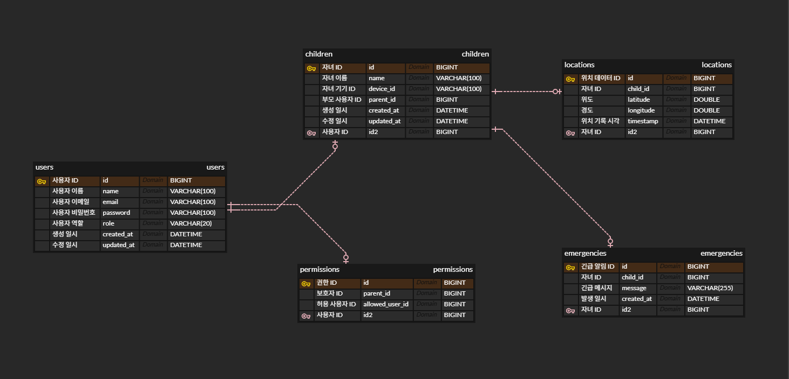

# 📁 프로젝트명  SafeKids 

미성년자의 위치를 보호자가 실시간 확인할 수 있는 웹 기반 위치 추적 시스템입니다.  
Spring Boot, MySQL, Redis, Docker, JWT 기반의 RESTful API를 제공합니다.

---

## 🎯 핵심 기능 9개

| 기능 | 설명 | 백엔드 |
|------|------|--------|
| **회원가입 / 로그인** | 보호자, 자녀, 허용된 사람, 관리자 구분 | 사용자 데이터 저장, 암호화, 인증 (JWT/OAuth), 세션/토큰 발급 |
| **사용자 역할 관리** | 각 역할별 접근 권한 및 화면 분리 | 역할 데이터 관리, 권한 체크 로직 |
| **자녀 등록 기능** | 보호자가 자녀 추가 | DB에 자녀 데이터 저장, 보호자-자녀 관계 관리 |
| **실시간 위치 추적 (지도)** | 자녀 현재 위치를 지도에 표시 (PC + 모바일 대응) | 위치 데이터 저장/조회 API 제공 |
| **위치 이력 보기** | 자녀 이동 경로 및 히스토리 조회 | 위치 데이터 조회 API, 검색/필터 처리 |
| **관할 설정 기능** | 특정 사용자에게 위치 접근 권한 부여/해제 | 권한 데이터 저장, 권한 확인 API |
| **긴급 상황 알림** | 자녀가 보호자에게 긴급 알림 전송 | 알림 이벤트 처리, 푸시/문자/이메일 발송 |
| **푸시 알림 / 웹 알림** | 브라우저 알림으로 실시간 알림 수신 | 알림 데이터 발송, Web Push 서버 처리 |
| **PWA 적용** | 설치형 앱처럼 보이고, 오프라인/캐싱/아이콘 지원 | (백엔드는 관여 없음 — 주로 프론트엔드) |

## 🔐 역할 관리

- 역할: `관리자(admin)`, `사용자(user)`, `자녀(child)`, `보호자(parent)`, `허용 사용자(trusted)`
- 역할에 따라 API 접근/메뉴 다르게 제한 가능  
  예: `/child/register` → 부모만 가능, 자녀는 불가능

---

## 👨‍👧 자녀 등록 방식

- 등록 정보: 자녀 이름, 생년월일, 아이디(이메일 또는 닉네임)
- 인증 방식: 로그인한 부모가 위치 전송 시 `child_id` 포함
- 서버는 해당 보호자와 `child_id`가 연결된 경우에만 처리 

---

## 🔐 권한 설정 (위치 공유 허용/차단)

- 특정 사용자에게 자녀의 위치 접근 권한 부여

---

## 🔧 기술 스택

- Java 17
- Spring Boot 3.x
- MySQL
- Redis
- Docker, Docker Compose
- JWT (인증)
- JPA (Hibernate)
- AWS (배포 예정)

---

## 🗂 ERD 다이어그램

